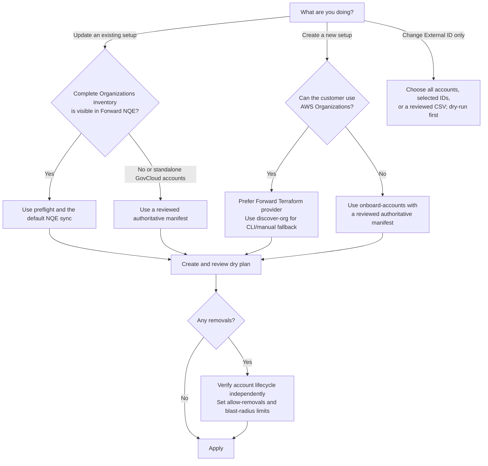

# aws-sync

`awssync` safely reconciles AWS account inventory with Forward Networks AWS cloud setups. It supports AWS Organizations discovery, reviewed account manifests, GovCloud, customer-defined External IDs, dry plans, guarded apply, and snapshot-ready automation.

## Choose a Workflow



The key choice is the inventory source. Use Forward NQE only when a current snapshot contains complete AWS Organizations evidence. Use a reviewed manifest when Organizations is unavailable, intentionally excluded, or not reliably represented—including standalone GovCloud environments.

## Safety Model

- Dry run is the default; writes require `--apply` and confirmation or `--yes`.
- Additions can be automated. Removals are blocked unless `--allow-removals` is explicit.
- `--max-removals` and `--max-removal-percent` impose independent blast-radius ceilings.
- Empty candidate inventory, stale snapshots, missing Organizations evidence, and unsafe GovCloud removal plans fail closed.
- Existing per-account External IDs are preserved. Adding accounts to a mixed-ID setup fails unless the new accounts have explicit CSV assignments.
- Saved plans are revalidated against current Forward state before apply.
- Generated payload and audit files are written atomically with owner-only `0600` permissions.
- Transient API failures are retried only for idempotent reads and full-state updates; create operations are never automatically retried.

## Install a Verified Release

Download the archive and checksum manifest for the required platform from [Releases](https://github.com/forwardnetworks/aws-sync/releases):

```bash
tar -xzf awssync-linux-amd64.tar.gz
chmod +x awssync-linux-amd64
sha256sum -c sha256sums.txt --ignore-missing
gh attestation verify awssync-linux-amd64 \
  --repo forwardnetworks/aws-sync
./awssync-linux-amd64 --version
```

Release assets are available for Linux and macOS on amd64 and arm64. Each release includes SHA-256 checksums and GitHub build-provenance attestations.

To build locally:

```bash
make build
./bin/awssync --version
```

## Existing Setup Quick Start

Set credentials without putting the password on the command line:

```bash
export FWD_HOST=https://fwd.app
export FWD_USER=you@example.com
export FWD_PASS='secret'
export FWD_NETWORK_ID=NETWORK_ID
```

In automation, always supply the network and setup IDs explicitly. Interactive runs can prompt when more than one is visible.

Check the current snapshot and Organizations evidence:

```bash
./bin/awssync preflight \
  --setup-id AWS-PROD \
  --max-snapshot-age 24h \
  --format human
```

Create a dry plan:

```bash
./bin/awssync \
  --setup-id AWS-PROD \
  --max-snapshot-age 24h \
  --output aws_sync_payload.json \
  --format human
```

Review `added_accounts`, `removed_accounts`, the role name, External ID state, regions, and payload hash. If no removals are planned, apply the freshly recomputed plan:

```bash
./bin/awssync \
  --setup-id AWS-PROD \
  --max-snapshot-age 24h \
  --output aws_sync_payload.json \
  --apply --yes
```

For an independently verified removal, add both approval and quantitative limits:

```bash
./bin/awssync \
  --setup-id AWS-PROD \
  --max-snapshot-age 24h \
  --output aws_sync_payload.json \
  --allow-removals \
  --max-removals 5 \
  --max-removal-percent 2 \
  --apply --yes
```

Never remove an account only because collection fails. If it remains visible in Organizations, repair its role, trust policy, External ID, or collection permissions.

## Customer-Defined External ID

Changing an External ID is a separate workflow and works with an existing IAM-user/access-key setup. With no `--account-id`, the command retains its setup-wide behavior. First review the Forward payload without changing anything:

```bash
./bin/awssync external-id \
  --setup-id AWS-PROD \
  --value customer-defined-value \
  --output aws_external_id_payload.json \
  --format human
```

Update the target-role trust policies to require the identical `sts:ExternalId`, test a representative account, then apply the Forward change:

```bash
./bin/awssync external-id \
  --setup-id AWS-PROD \
  --value customer-defined-value \
  --output aws_external_id_payload.json \
  --apply --yes
```

Later syncs preserve the value. To roll back, first relax the AWS trust policies, verify role assumption, then run the same command with `--clear` instead of `--value`.

For a representative-account test or different values per account, scope the command with one or more account IDs:

```bash
./bin/awssync external-id \
  --setup-id AWS-PROD \
  --account-id 111111111111 \
  --value test-external-id \
  --output aws_external_id_test.json \
  --format human
```

For a reviewed batch, use CSV. `set` requires a non-empty value; `clear` requires an empty value. A blank cell by itself never means clear.

```csv
setup_id,account_id,action,external_id
AWS-PROD,111111111111,set,account-one-value
AWS-PROD,222222222222,set,account-two-value
AWS-PROD,333333333333,clear,
```

```bash
./bin/awssync external-id \
  --setup-id AWS-PROD \
  --external-id-file external-ids.csv \
  --output aws_external_id_payload.json \
  --format human
```

Omitted accounts remain unchanged. Duplicate, malformed, wrong-setup, and unknown account rows stop before any PATCH. The generated payload still contains the complete current account list because Forward updates this field as full state.

Ordinary NQE, webhook, and `sync-accounts` runs preserve each existing account's value. If a mixed-ID setup discovers a new account, preflight and dry-run fail closed until that account is assigned in the same CSV passed with `--external-id-file`.

## Onboarding and GovCloud

| Environment | Inventory source | Recommended command or workflow |
| --- | --- | --- |
| New commercial AWS Organization | AWS Organizations | Forward Terraform provider; `discover-org` is the CLI/manual fallback |
| Existing setup with complete Organizations data in Forward | Current Forward snapshot/NQE | `preflight`, dry plan, then guarded apply |
| No Organizations access | Reviewed account manifest | `onboard-accounts` or `sync-accounts` |
| GovCloud with complete Organizations data collected by Forward | Current Forward snapshot/NQE | Regular workflow, after preflight confirms evidence |
| Standalone or incomplete GovCloud inventory | Reviewed `aws-us-gov` manifest | `onboard-accounts` or `sync-accounts` |

Manifest-based sync treats the reviewed file as authoritative, but still blocks removals unless the operator explicitly allows and bounds them. GovCloud role ARNs retain the `arn:aws-us-gov` partition and mixed-partition plans are rejected.

## Automation

For scheduled jobs, run preflight and the dry plan without removal flags. This allows normal additions while unexpected removals stop for review. Archive the human/JSON summary, payload SHA-256, snapshot ID, selected setup IDs, and applied payload.

For event-driven operation, `serve-webhook` accepts Forward `SNAPSHOT_READY` events and serializes sync jobs through a bounded queue. Install it behind TLS, configure Basic authentication, and use `configure-webhook` to create or update the Forward webhook.

Do not pass Forward or AWS secrets as command-line arguments in shared process environments. Prefer protected environment injection or a service manager secret facility. Generated files are `0600`, but they may still contain sensitive static-key material and must be retained or deleted according to the customer's credential policy.

## Documentation

| Guide | Use it for |
| --- | --- |
| [Quick start](docs/quick-start.md) | Copy/paste commands, setup selection, and troubleshooting |
| [AWS account sync procedure](docs/aws-account-sync-procedure.md) | Complete prerequisites, IAM, automation, and validation runbook |
| [GovCloud workflow](docs/govcloud-workflow.md) | Organizations and standalone-account GovCloud decisions |
| [Architecture and flowcharts](docs/architecture-flow.md) | Full data flow, permissions, credential modes, and security boundaries |
| [Terraform examples](examples/terraform/README.md) | AWS discovery role and collection-role StackSets |

## Development

```bash
make ci
```

`make ci` checks formatting, runs `go vet`, unit tests, the race detector, `govulncheck`, and a reproducible local build. Pull-request and release workflows run with read-only repository permissions except for the release publishing job, which receives only the permissions needed to upload assets and provenance.
