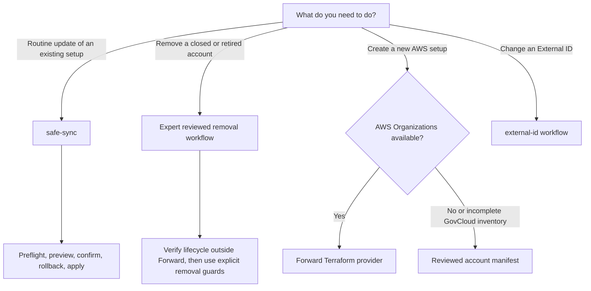

# aws-sync

`awssync` keeps the account list in an existing Forward Networks AWS setup synchronized with the AWS inventory already collected by Forward.

Most operators should use `safe-sync`. It runs the safety checks, shows a short preview, and asks before changing Forward. It can add or re-enable accounts, but it cannot remove them.

## Routine Safe Sync

### 1. Download and verify

Download the archive and `sha256sums.txt` for your platform from [Releases](https://github.com/forwardnetworks/aws-sync/releases).

```bash
tar -xzf awssync-linux-amd64.tar.gz
sha256sum -c sha256sums.txt --ignore-missing
gh attestation verify awssync-linux-amd64 \
  --repo forwardnetworks/aws-sync
./awssync-linux-amd64 --version
```

Release assets are available for Linux and macOS on amd64 and arm64.

### 2. Set the Forward login

```bash
export FWD_HOST=https://fwd.app
export FWD_USER=you@example.com
export FWD_NETWORK_ID=NETWORK_ID
```

Do not put the Forward password in a shared script. `safe-sync` prompts for it without displaying it.

`FWD_NETWORK_ID` is optional in an interactive terminal. If the user can see several networks, `safe-sync` displays a numbered picker.

### 3. Run one command

For one AWS setup:

```bash
./awssync-linux-amd64 safe-sync \
  --setup-id AWS-PROD
```

For two AWS setups:

```bash
./awssync-linux-amd64 safe-sync \
  --setup-id AWS-PROD \
  --setup-id AWS-SANDBOX
```

`safe-sync` then:

1. Selects the latest processed Forward snapshot and requires it to be no more than 24 hours old.
2. Runs preflight checks.
3. Shows each setup with `configured`, `discovered`, `add`, `reenable`, and `remove`.
4. Refuses to continue unless `remove=0`.
5. Prompts for the word `apply`.
6. Confirms that the reviewed payload has not changed.
7. Writes a rollback file before PATCHing Forward.

Example preview:

```text
Safe sync preview
  network:  12345
  snapshot: 67890
  mode:     additive only (account removal is disabled)

Setups:
  - AWS-PROD: configured=325 discovered=10 add=0 reenable=315 remove=0

Changes: add=0 reenable=315 remove=0
```

Type `apply` only when the selected network, snapshot, setup IDs, and counts are expected.

### What the counts mean

| Count | Meaning |
| --- | --- |
| `configured` | Accounts currently present in the Forward setup |
| `discovered` | Accounts visible in the selected Forward snapshot/NQE result |
| `add` | Newly discovered accounts that will be added |
| `reenable` | Existing unchecked accounts that will be checked again |
| `remove` | Always zero in `safe-sync` |

An account can be configured but show `Collected? false` because it is unchecked or collection failed. `safe-sync` preserves it. A failed IAM role, trust policy, External ID, or collection permission is a repair task—not evidence that the account should be deleted.

## Which Workflow Should I Use?


```mermaid
flowchart TD
    A[What do you need to do?] -->|Routine update of an existing setup| B[safe-sync]
    A -->|Remove a closed or retired account| C[Expert reviewed removal workflow]
    A -->|Create a new AWS setup| D{AWS Organizations available?}
    A -->|Change an External ID| E[external-id workflow]
    D -->|Yes| F[Forward Terraform provider]
    D -->|No or incomplete GovCloud inventory| G[Reviewed account manifest]
    B --> H[Preflight, preview, confirm, rollback, apply]
    C --> I[Verify lifecycle outside Forward, then use explicit removal guards]
```

Use `safe-sync` for ordinary account additions and unchecked accounts. The remaining commands are expert workflows:

| Need | Workflow |
| --- | --- |
| Routine existing-setup sync | `safe-sync` |
| Scheduled or JSON automation | Standard `awssync` command |
| Independently verified account removal | Standard command with the reviewed removal workflow |
| New commercial AWS Organization | Forward Terraform provider; `discover-org` is the manual fallback |
| No Organizations access | `onboard-accounts` or `sync-accounts` with a complete manifest |
| GovCloud | [GovCloud workflow](docs/govcloud-workflow.md) |
| One or more External ID changes | `external-id` |

## When Safe Sync Stops

`safe-sync` makes no Forward change when:

- no processed snapshot is available;
- the latest processed snapshot is older than 24 hours;
- NQE returns no valid AWS account rows;
- a selected setup does not exist or is not AWS;
- the setup has an ambiguous mixed External ID for a newly discovered account;
- the preview unexpectedly contains a removal;
- the payload changes after review;
- the Forward setup changes immediately before PATCH.

Fix the reported condition and run the same command again. Do not add removal overrides to make a routine run pass.

## Account Removal Is a Separate Expert Workflow

`safe-sync` has no removal switches. Removing an account requires an operator to confirm outside Forward that the AWS account was closed, retired, or removed from the intended Organization.

The standard NQE workflow requires all of the following before a removal can be applied:

- `--prune-missing`
- `--allow-removals`
- a nonzero `--max-removals`
- a nonzero `--max-removal-percent`
- additional Organizations-evidence overrides when applicable

Prefer `sync-accounts` with a complete authoritative manifest for lifecycle removals. Never remove an account only because its collection fails.

See [AWS account sync procedure](docs/aws-account-sync-procedure.md#apply-the-sync) for the reviewed removal commands and rollback procedure.

## Automation

For scheduled additive-only operation, use the standard command without any prune or removal flags:

```bash
./awssync-linux-amd64 \
  --network-id NETWORK_ID \
  --setup-id AWS-PROD \
  --max-snapshot-age 24h \
  --output aws_sync_payload.json \
  --apply --yes --json
```

The standard command is additive by default, pins one processed snapshot, writes the payload before PATCH, verifies current setup state, and writes `<output>.rollback.json`.

For event-driven operation, `serve-webhook` accepts Forward `SNAPSHOT_READY` events and serializes jobs through a bounded queue.

Do not pass Forward or AWS secrets on command lines in shared process environments. Use protected environment injection or a service-manager secret facility.

## External IDs, Onboarding, and GovCloud

These are separate from routine synchronization:

- [External ID procedure](docs/aws-account-sync-procedure.md#customer-defined-external-id-with-an-iam-user)
- [New AWS Organizations onboarding](docs/aws-account-sync-procedure.md#onboard-from-aws-organizations-directly)
- [Account-manifest workflow](docs/architecture-flow.md)
- [AWS GovCloud workflow](docs/govcloud-workflow.md)

Existing per-account External IDs are preserved during ordinary synchronization. New accounts in a mixed-ID setup fail closed until a reviewed CSV provides the intended value.

## Safety Guarantees

- Routine NQE synchronization is additive; accounts missing from NQE remain configured.
- `safe-sync` cannot remove accounts.
- Human-readable output is the default; `--json` is for standard-command automation.
- The latest processed snapshot is pinned before planning.
- Invalid NQE account-ID placeholders are ignored and reported.
- Every apply writes a complete pre-change rollback payload.
- The reviewed target payload and current Forward setup are revalidated before PATCH.
- Generated payloads use atomic owner-only `0600` files.
- Idempotent reads and full-state updates use bounded transient retries.

## Documentation

| Guide | Use it for |
| --- | --- |
| [Routine safe sync](docs/routine-safe-sync.md) | One-page operator handoff |
| [Quick start](docs/quick-start.md) | Standard CLI examples and troubleshooting |
| [AWS account sync procedure](docs/aws-account-sync-procedure.md) | IAM prerequisites, automation, removals, and rollback |
| [GovCloud workflow](docs/govcloud-workflow.md) | Organizations and standalone-account GovCloud decisions |
| [Architecture and flowcharts](docs/architecture-flow.md) | Data flow, permissions, and security boundaries |
| [Terraform examples](examples/terraform/README.md) | Discovery role and collection-role StackSets |

## Build and Test

```bash
make ci
```

`make ci` checks formatting, runs `go vet`, unit tests, the race detector, `govulncheck`, and a reproducible local build.
