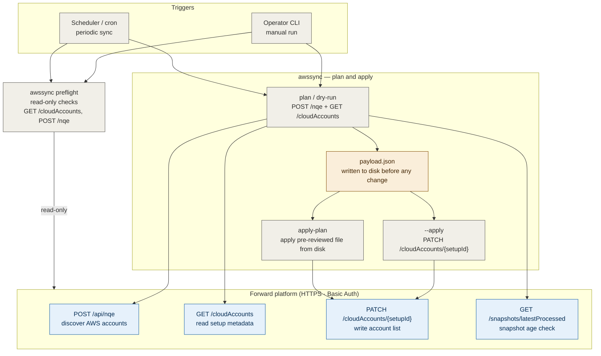
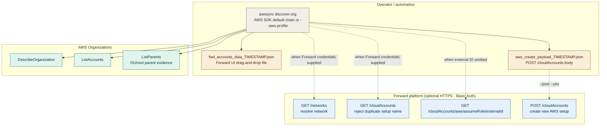
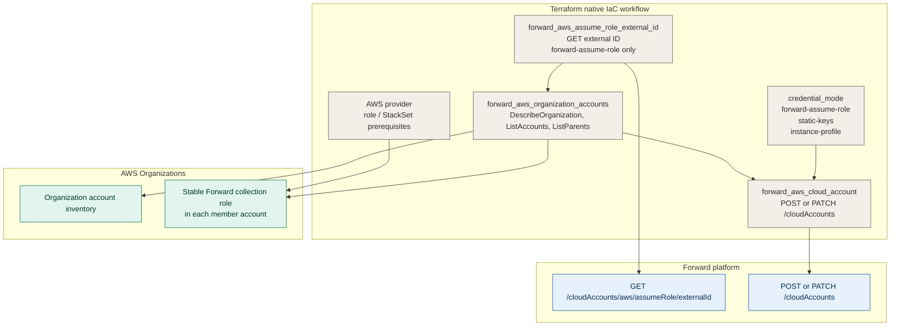
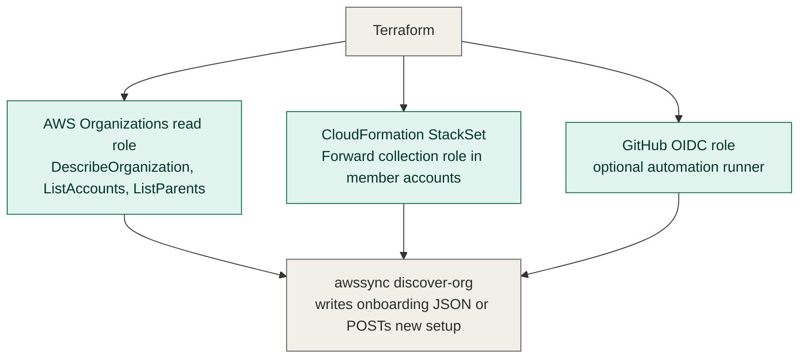
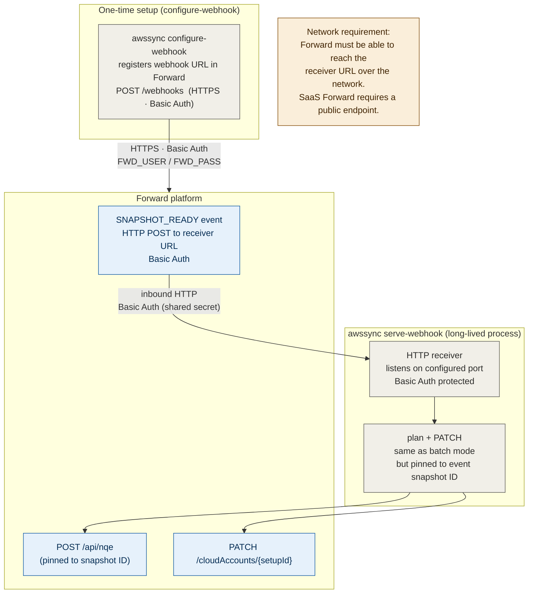
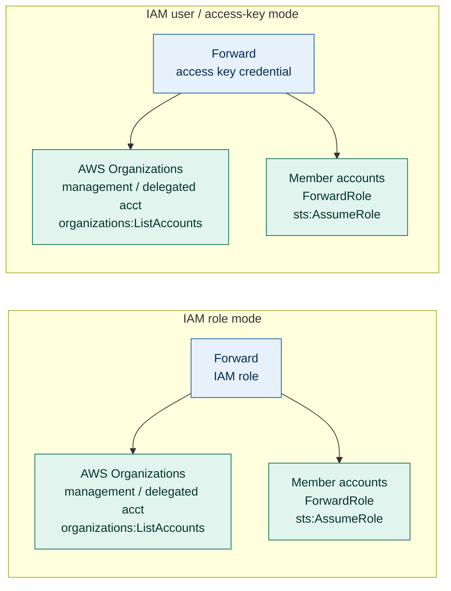

# AWS Account Sync — End-to-End Flow

This document shows how `awssync` runs end to end in its operational modes,
the connection types and direction between each component, and the permissions
required at each layer. It is intended for architecture review and approval
workflows.

GitHub renders the Mermaid diagrams below automatically.

---

## Mode 1 — Existing Setup Sync

Operator or scheduler invokes `awssync` directly to update one or more existing Forward AWS setups from Forward NQE data.

---

## Mode 2 — Initial AWS Organizations Onboarding

`awssync discover-org` is for a new Forward AWS setup. It calls AWS Organizations directly, writes the Forward UI upload JSON, writes the Forward create-setup POST body, and can optionally POST that new setup to Forward. It does not PATCH existing setups.

---

## Mode 3 — Native IaC Onboarding With Terraform

For new AWS Organizations onboarding, the preferred automation path is the Forward Terraform provider. Terraform can prepare AWS-side roles, read AWS Organizations, fetch Forward's external ID when needed, and create or update the Forward AWS cloud setup in one plan/apply workflow. The provider supports Forward assume-role, static-key, and collector instance-profile credential models.

---

## Optional Terraform Bootstrap For CLI Fallback

Terraform can also prepare AWS access before `awssync discover-org` runs. Use this when you need CLI-generated manual JSON files or a break-glass create payload instead of the native provider-managed Forward setup.

---

## Mode 4 — Webhook Daemon

`awssync serve-webhook` runs as a long-lived HTTP server. Forward calls it on
each `SNAPSHOT_READY` event. Traffic direction is **inbound to awssync**.

---

## AWS Credential Modes

For existing setup sync and webhook sync, `awssync` does not connect to AWS. The following two modes describe how **Forward** connects to AWS. Both end in `sts:AssumeRole` per member account.

For `discover-org`, `awssync` also uses AWS credentials locally to read AWS Organizations. Those discovery credentials are not written to Forward. Static-key Forward collection requires separate collector key material if the create payload will be posted.

---

## Permissions summary

### awssync → Forward

| API call | Purpose | Required Forward permission |
| --- | --- | --- |
| `POST /api/nqe` | Discover AWS accounts | read NQE |
| `GET /networks` | Resolve network ID | read networks |
| `GET /cloudAccounts` | Read setup metadata | read cloud accounts |
| `PATCH /cloudAccounts/{id}` | Write account list | write cloud accounts |
| `GET /cloudAccounts/aws/assumeRole/externalId` | Fetch Forward-generated AWS external ID for onboarding | read cloud account setup metadata |
| `POST /cloudAccounts` | Create a new AWS setup from `discover-org --post` | write cloud accounts |
| `GET /snapshots/latestProcessed` | Check snapshot age | read snapshots |
| `POST /webhooks` | Register webhook | manage webhooks |

### awssync → AWS Organizations (`discover-org` only)

| API call | Purpose |
| --- | --- |
| `organizations:DescribeOrganization` | Verify the credentials can see an AWS Organization and get the management account ID |
| `organizations:ListAccounts` | Build the account list for the Forward setup |
| `organizations:ListParents` | Record parent/root or OU evidence per account |

### Forward → AWS (both credential modes)

| Where | Permission | Purpose |
| --- | --- | --- |
| Org management / delegated account | `organizations:ListAccounts` | discover account inventory |
| Each member account | `ForwardRole` IAM role exists | collection target |
| Each member account | Trust policy allows Forward to assume role | `sts:AssumeRole` |
| Each member account | Read permissions on network resources | collection |

### Webhook receiver (inbound)

| What | Detail |
| --- | --- |
| Listening port | Configurable (default example: `:8080`) |
| Protocol | HTTP (TLS terminated at reverse proxy recommended for production) |
| Authentication | HTTP Basic Auth — shared secret between Forward and receiver |
| Caller | Forward platform (SaaS: internet; on-prem: Forward app server) |

---

## Key security properties

- Existing setup sync and webhook sync do not connect to AWS; they use Forward NQE data.
- `discover-org` connects to AWS Organizations only for initial onboarding. It does not write the discovery credentials to Forward.
- The payload JSON is **always written to disk before any PATCH** — changes can be reviewed before or instead of applying.
- `discover-org` writes both onboarding JSON files before any optional `POST /cloudAccounts`.
- Static-key collector secrets are only included in the create payload when explicitly supplied. Without the secret, the file contains a placeholder and is marked not POST-ready.
- Removals require explicit `--allow-removals` flag; `awssync` will not silently
  remove accounts from a Forward setup.
- Webhook receiver is protected by HTTP Basic Auth with a shared secret
  independent of Forward user credentials.

For the full operational procedure see
[AWS Account Sync Procedure](aws-account-sync-procedure.md).
