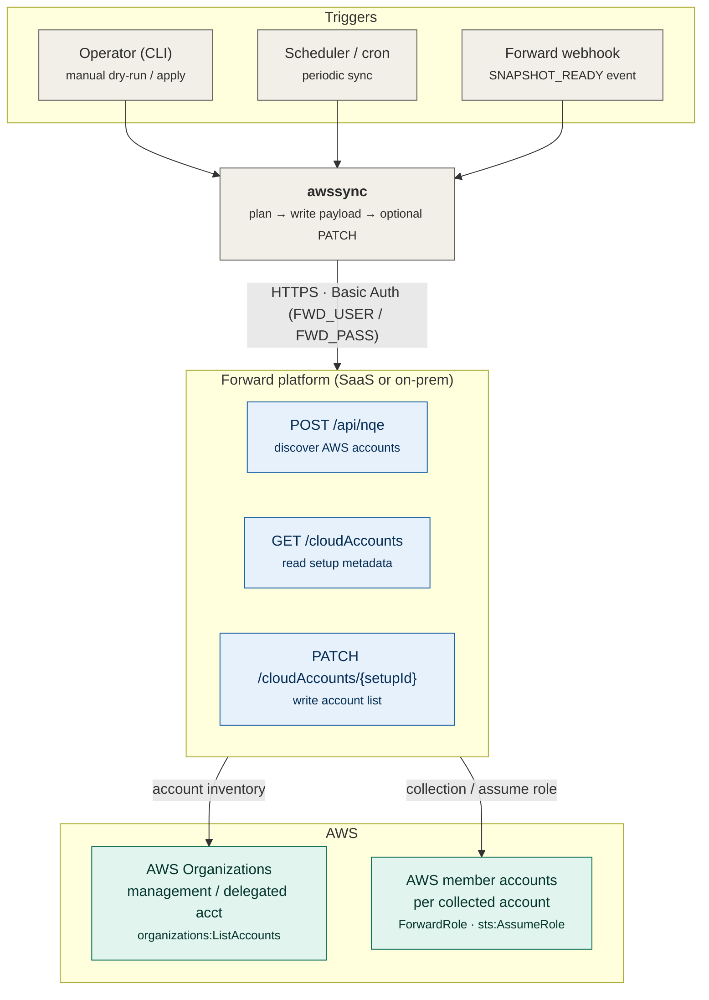

# AWS Account Sync — End-to-End Flow

This diagram shows how `awssync` runs end to end, the connection types between
each component, and the permissions required at each layer. It is intended for
architecture review and approval workflows.

GitHub renders the Mermaid diagram below automatically.

## Flow

## Connection types

Only two connection types exist:

- **`awssync` &rarr; Forward** — HTTPS REST, HTTP Basic Auth (`FWD_USER` / `FWD_PASS`).
  The same Basic Auth model secures the webhook receiver (`serve-webhook`).
- **Forward &rarr; AWS** — AWS APIs using IAM (role or access key) plus
  `sts:AssumeRole` per account.

`awssync` never connects to AWS and holds no AWS credentials. It only reads from
and writes to the Forward platform.

## Permissions required

| Layer | Where | Permission |
| --- | --- | --- |
| Forward user | Forward platform | read NQE, read/PATCH `cloudAccounts`, manage webhooks |
| AWS discovery | Org management / delegated account | `organizations:ListAccounts` |
| AWS collection | each member account | `ForwardRole` exists, trust policy allows Forward, `sts:AssumeRole`, read permissions |

## Two-layer model

1. **AWS Organizations** tells Forward which accounts exist.
2. **IAM roles** in each AWS account let Forward collect those accounts.

`awssync` automates layer 1 into Forward's configured account list. Layer 2 must
already exist in AWS: a newly added account appears in Forward but fails
collection until the expected IAM role and trust policy are in place.

For the full operational procedure, see
[AWS Account Sync Procedure](aws-account-sync-procedure.md).
