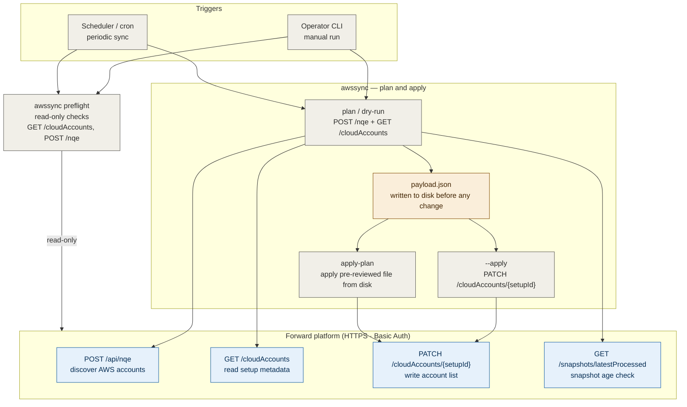
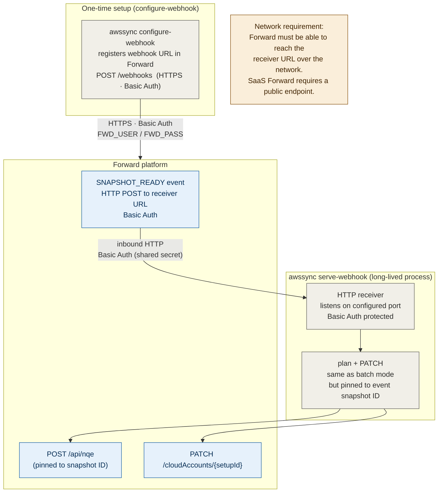
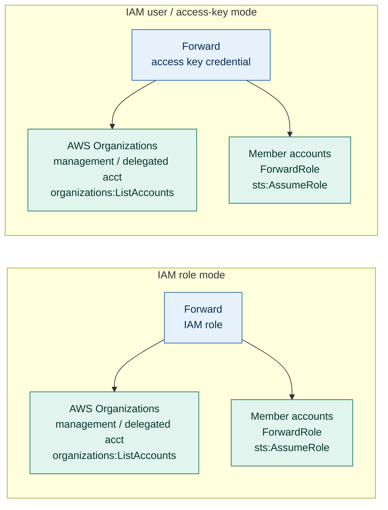

# AWS Account Sync — End-to-End Flow

This document shows how `awssync` runs end to end in both operational modes,
the connection types and direction between each component, and the permissions
required at each layer. It is intended for architecture review and approval
workflows.

GitHub renders the Mermaid diagrams below automatically.

---

## Mode 1 — Batch / manual

Operator or scheduler invokes `awssync` directly.

---

## Mode 2 — Webhook daemon

`awssync serve-webhook` runs as a long-lived HTTP server. Forward calls it on
each `SNAPSHOT_READY` event. Traffic direction is **inbound to awssync**.

---

## AWS credential modes (Forward → AWS)

`awssync` holds no AWS credentials. The following two modes describe how
**Forward** connects to AWS. Both end in `sts:AssumeRole` per member account.

---

## Permissions summary

### awssync → Forward

| API call | Purpose | Required Forward permission |
| --- | --- | --- |
| `POST /api/nqe` | Discover AWS accounts | read NQE |
| `GET /networks` | Resolve network ID | read networks |
| `GET /cloudAccounts` | Read setup metadata | read cloud accounts |
| `PATCH /cloudAccounts/{id}` | Write account list | write cloud accounts |
| `GET /snapshots/latestProcessed` | Check snapshot age | read snapshots |
| `POST /webhooks` | Register webhook | manage webhooks |

### Forward → AWS (both credential modes)

| Where | Permission | Purpose |
| --- | --- | --- |
| Org management / delegated account | `organizations:ListAccounts` | discover account inventory |
| Each member account | `ForwardRole` IAM role exists | collection target |
| Each member account | Trust policy allows Forward to assume role | `sts:AssumeRole` |
| Each member account | Read permissions on network resources | collection |

### Webhook receiver (inbound)

| What | Detail |
| --- | --- |
| Listening port | Configurable (default example: `:8080`) |
| Protocol | HTTP (TLS terminated at reverse proxy recommended for production) |
| Authentication | HTTP Basic Auth — shared secret between Forward and receiver |
| Caller | Forward platform (SaaS: internet; on-prem: Forward app server) |

---

## Key security properties

- `awssync` **never connects to AWS** and holds no AWS credentials.
- `awssync` only reads from and writes to the Forward platform API.
- The payload JSON is **always written to disk before any PATCH** — changes can be reviewed before or instead of applying.
- Removals require explicit `--allow-removals` flag; `awssync` will not silently
  remove accounts from a Forward setup.
- Webhook receiver is protected by HTTP Basic Auth with a shared secret
  independent of Forward user credentials.

For the full operational procedure see
[AWS Account Sync Procedure](aws-account-sync-procedure.md).
